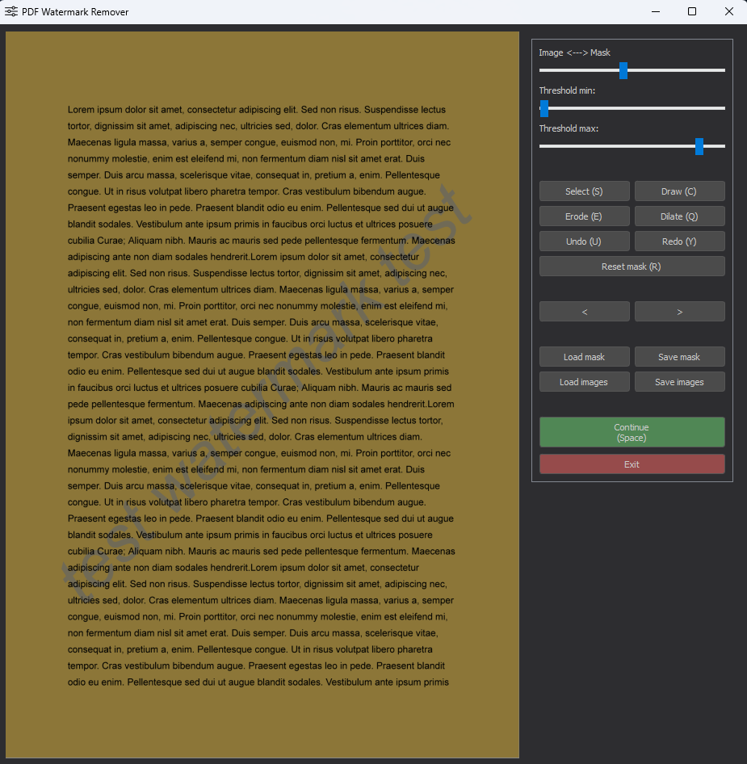
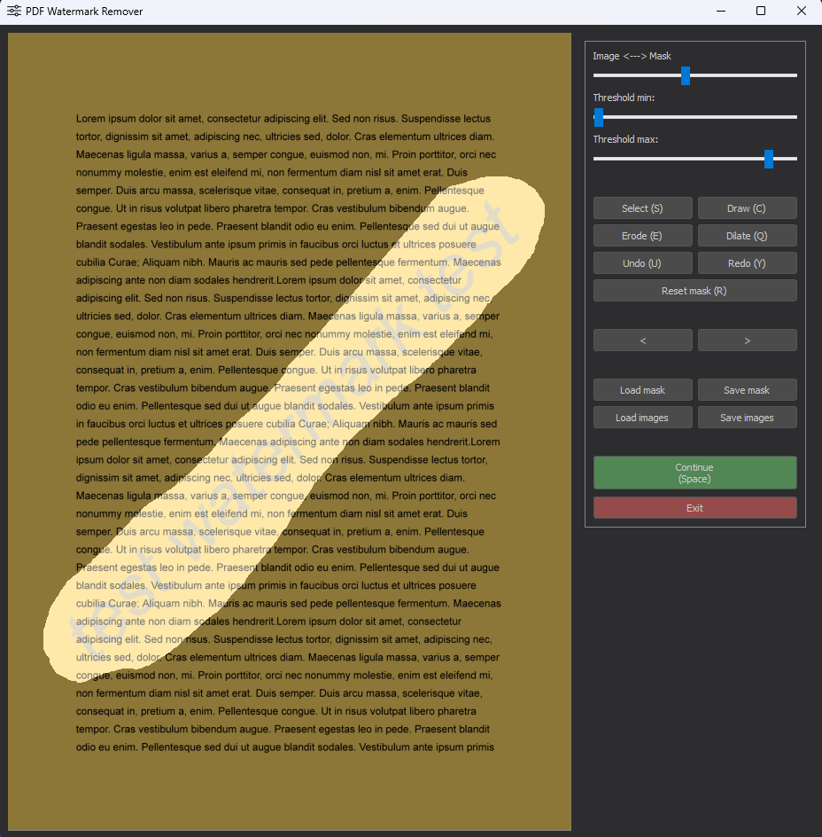
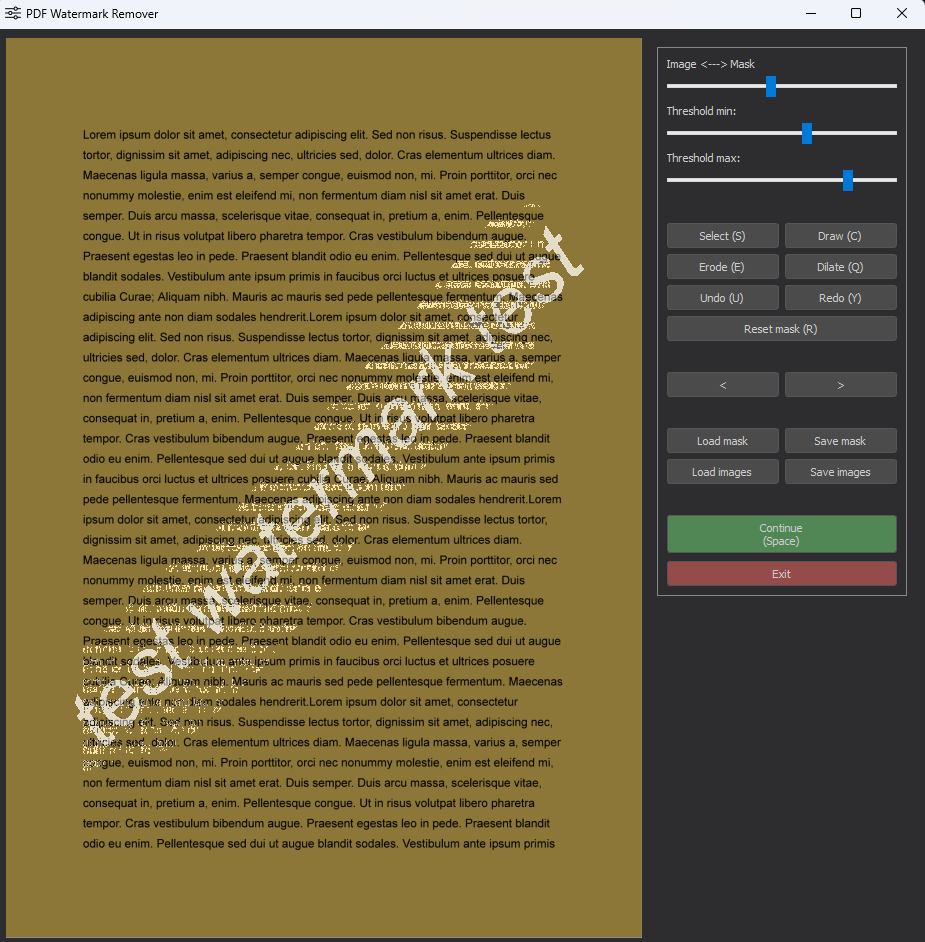
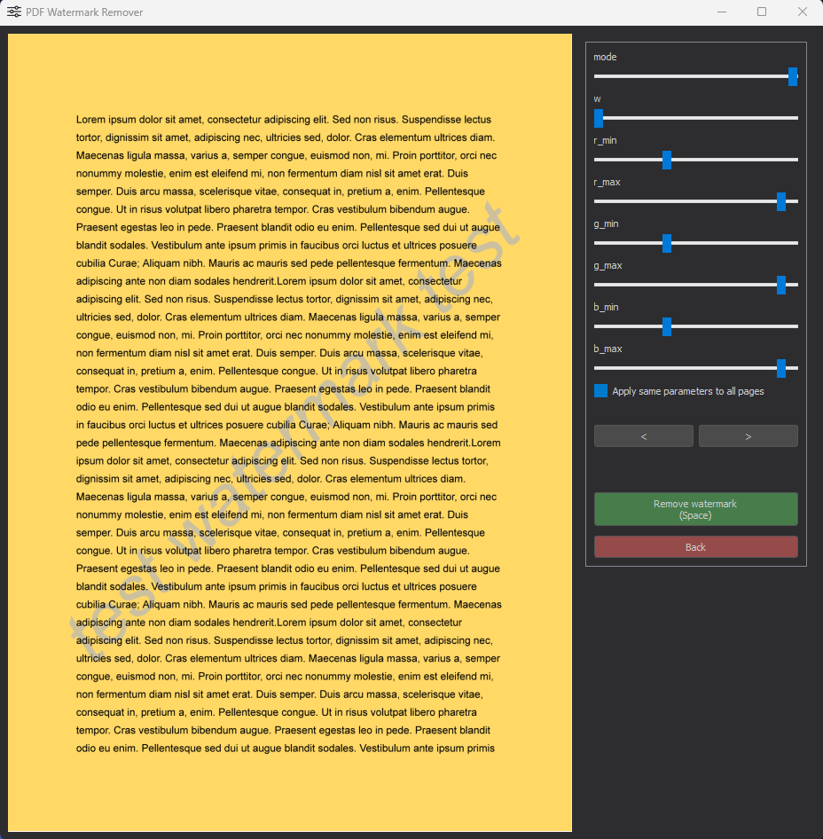

#  Watermark Remover


A Python application for removing watermarks from PDF files using mask-based image processing. Supports multiple GUI frameworks (PyQt, Tkinter, OpenCV) and a Flask web interface.

## Overview


## Features
- **PDF to Image Conversion:** Converts each page of the PDF into an image for processing.
- **Area Selection:** Allows users to select the area of the watermark using a graphical interface.

- **Thresholding:** Applies thresholding to create a binary mask of the watermark area.

- **Mask Drawing:** Users can manually refine the mask by drawing on it. Right-click to erase, left-click to draw. There are two cursor types: circle and rectangle.
- **Mask Erosion/Dilation:** Provides options to erode or dilate the mask to improve accuracy.
- **Color Range Setting:** Allows users to set a color range to further refine which parts of the image should be considered as part of the watermark. Each page can have its own color range and mode (inpainting or filling with the most common color).
  
- **Watermark Removal:** Removes the watermark from the images and saves the output as a new PDF file, either by filling the area with the most common color or by inpainting.


## Python Version Compatibility

This script is compatible with `Python 3.6` and above.

## Dependencies

The script requires the following Python libraries:

- `opencv-contrib-python`: For image processing tasks.
- `pymupdf`: For handling PDF files.
- `pyqt5`: For the graphical user interface.
- `Pillow`: For image handling.

## Installation 

0. **Clone the repository**

    ```bash
    git clone https://github.com/banatibalazs/pdf-watermark-remover.git
   ```
    ```commandline
    cd pdf-watermark-remover
    ```
1. **Create a virtual environment and activate it**

    ```bash
    python -m venv env_name
    ```
   - on Windows:
    
        ```bash
        env_name\Scripts\activate
        ```

   - on Linux:
        ```
        source env_name/bin/activate
        ```

2. **Install the required libraries.**
    
    ```bash
    pip install opencv-contrib-python pymupdf PyQt5 Pillow
    ```

## Running the Script

```
python remover.py 
```


The arguments for the script are as follows (all are optional)
- **pdf_path**: The path to the PDF file. Default is `input.pdf`.
- **save_path**: The path to save the output PDF file. Default is `output.pdf`.
- **--dpi**: The resolution of the images extracted from the PDF file. Default is `200`.
- **--max_width**: The maximum width of the images shown during the mask selection. Default is `1400`.
- **--max_height**: The maximum height of the images shown during the mask selection. Default is `800`.


```
python remover.py input.pdf output.pdf --dpi 300 --max_width 1920 --max_height 1080
```


## Troubleshooting

- **Process is too slow:**

   The reading of large PDF files can be slow, especially if the resolution is high. If the process is too slow, try decreasing the `dpi` parameter.

## Disclaimer

This script is for educational purposes only. The watermark removal process may not be perfect and may not work for all types of watermarks. The script may also remove parts of the image that are not watermarks. Use this script at your own risk.
